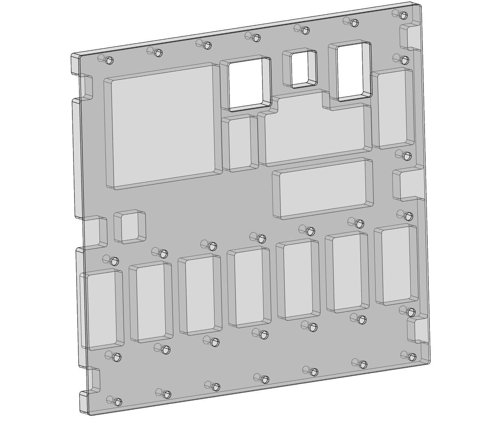

# Protective Cover

A Protective cover made of two laser cut acrylic sheets that can be mounted on the back of the backplane board. It provides some extra protection against mechanical abuse or accidental shorts. Design files can be found in this folder.

The 2 layers can be laser cut from many materials. Transparant Acrylic is an option. The spacer needs to be 5mm think to accomodate component height.

# Bill of Materials

| Qty | Description                                                                     | Manufacturer | Partnumber |
|-----|---------------------------------------------------------------------------------|--------------|------------|
| 14  | A2 s/steel cross pan head screw, M2.5 x 12mm                                    | RS PRO       | 528-722    |
| 14  | A2 S/Steel Locking Half Nut, DIN 439, M2.5                                      | RS PRO       | 122-4399   |
| 1   | Backplane PCB assembly                                                          |              |            |
| 1   | Protective Spacer                                                               |              |            |
| 1   | Protective Cover                                                                |              |            |

# Assembly Instructions

Note: Removing protective liner on acrylic sheets creates significant charge. Make sure this is dissipated before installation!