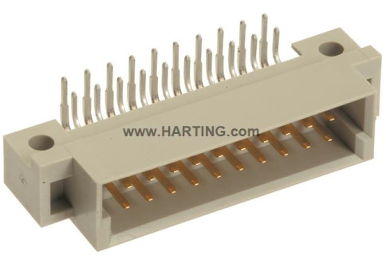

# Backplane

The core of the system is a 3U / 28HP backplane PCB that can be mounted in various mechanical configuations. The main functionality is:
- 24V Powered (5A Max)
- 7 Slots, of which 1 can be used as host (USB+I2C)
- Daisy-chainable up to three boards to fill a full rack
- 24V and 5V power distribution, protection and monitoring to modules (2A Max)
- 100Mbps Ethernet Switch (KSZ8999: 7 Slots + Uplink)
- USB 2.0 Hi-Speed 7-Port Hub Controller (USB2517)
- I2C Mux (Dedicated channel for each module)
- 2 Additional voltage rails and 2 differential pairs (CAN) - passively connected between slots

It uses [DIN 41612](https://en.wikipedia.org/wiki/DIN_41612) connectors for the plug-in modules, for examaple the [Harting 09241206921](https://b2b.harting.com/ebusiness/nl/DIN-Signal-3B020MS-30C1-2/09241206921), but since it's a standard other vendors are also available.

Optionally the rear can be covered using 2-layer laser-cut acrylic sheets for protection against bumps and shorts. Details can be found [here](./Protective%20Cover).

Mating Connector for Power Jack: PP3-002B (2.5mm Pin / 5.5mm Diameter)

### Slot Interface
Each slot has a 20-pin connector (3B, Bottom-aligned) connector with the following pinout:

|    | A       | B       |
|----|---------|---------|
| 1  | LAN RX- | LAN RX+ |
| 2  | LAN TX- | LAN TX+ |
| 3  | USB D-  | USB D+  |
| 4  | SDA     | SCL     |
| 5  | GND     | +5V     |
| 6  | GND     | +24V    |
| 7  | CANA L  | CANA H  |
| 8  | CANB L  | CANB H  |
| 9  | GND     | VADJ2   |
| 10 | DETECT  | VADJ1   |

Modules are hot-swappable. By grounding the detect pin is on the plug-in module the Hot-Swap controller will enable power. 
Note that Ethernet is capacitively coupled - use of additonal magnetics might be advised depending on the application.

## Host Interface
There is a special host slot which has a second 20-pin connector which is used for USB-Host and I2C Master functionality. For Ethernet based functionality the use of this is optional.

It has the following pinout:

|    | A         | B         |
|----|-----------|-----------|
| 1  | NC        | NC        |
| 2  | SDA_HOST  | SCL_HOST  |
| 3  | DETECT    | RESET_HOST|
| 4  | GND       | GND       |
| 5  | USB3 D-   | USB3 D+   |
| 6  | GND       | GND       |
| 7  | USB2 D-   | USB2 D+   |
| 8  | GND       | GND       |
| 9  | USB1 D+   | USB1 D+   |
| 10 | GND       | GND       |

Note that USB 1 is from the backplane itself, USB 2 and 3 are from daisy chained backplanes if present. When there is no host card present, USB 1 and 2 are routed to the daisy chain connector (to be come USB 2 and 3 on the next board).

For a typical setup this slot contains something like a Raspberry Pi to control the rest of the system and/or bridge it to the network.

# Version History

## B.X
Scheduled - to fix known issues on version A.10

### Changes
LTC4222 optional? LAN/USB optional?

## A.10
First Release

### Known Issues
- LTC4222 generates INTVCC from VDD2, which is 5V, which is gated by itself, 5V/24V need to be swapped
    - Rework: Bypassed primary 24V Hot Swap controller output with a jumper wire
- I2C Mux messed up pinout ([excel table](./Documentation/rework-reva-i2cmux.md))
    - Rework: Swapped some nets to fix I2CM and I2C0 ([picture](./Documentation/rework-reva-i2cmux.png))
- I2C A0/A1 missing pull-up (or push/pull output (Both NC/NC)
    - Rework: Added A0/A1 pull-up 4k7 ([picture](./Documentation/rework-reva-address-pullup.png))
- Bad US_REF value (Also update table)
    - Rework: Swapped R199/R200
- Edge connector slots are too short and flipped between left/right
    - Rework: Cut material using scalpel
- I2C LTC4222 Address overlap with SLOT2/Main power
    - Rework: Connected PWR_ADR0 to GND
- 24V/5V PGOOD has some issues, might be due to under/overcurrent config
    - *TODO*
- RJ45 Jack LED Polarity is reversed
- Silkscreen indicating upstream/downstram direction is missing
- 24/5V LED silkscreen is swapped
- USB/LAN EEPROMs should be depopulated?
- Wash after hand solder (Eurocircuits)
- Missing EEPROM/Serial chip for identification

### TODO
- Validate power rail stability/noise
- Validate overcurrent protection (board / module level)
- Measure current consumption for USB/LAN
v Test I2C Address Daisy chain
- Validate thermal performance with and without plastic cover (especialy on buck converters)
- Validate hot-swapping behavior
v Validate USB daisy chaning
- Check weird sounds