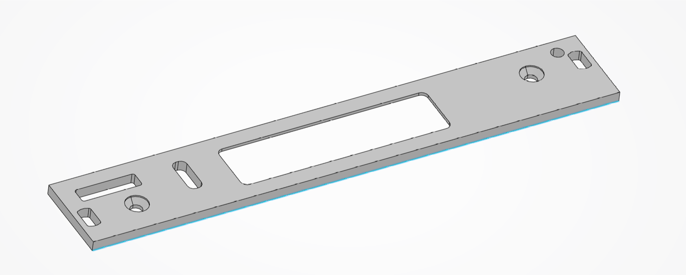
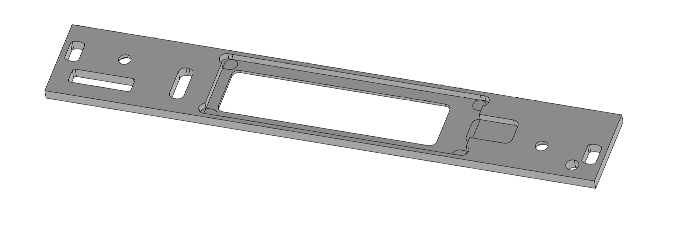

# Frontpanel for ELW2106AA with USB-C

LCD: [ELW2106AA](https://nl.mouser.com/datasheet/2/921/Futaba-04-14-2020-ELW2106AA_E_SHORT-1830779.pdf)
USB-C Connector: [Molex 2169890001](https://www.molex.com/molex/products/part-detail/io_connectors/2169890001) / [Kycon KUSBX-SL-CS1N14-B](http://www.kycon.com/Pub_Eng_Draw/KUSBX-SL-CS1N14-B.pdf)

Can be ordered through Front Panel Express, approx price 30 Euro
