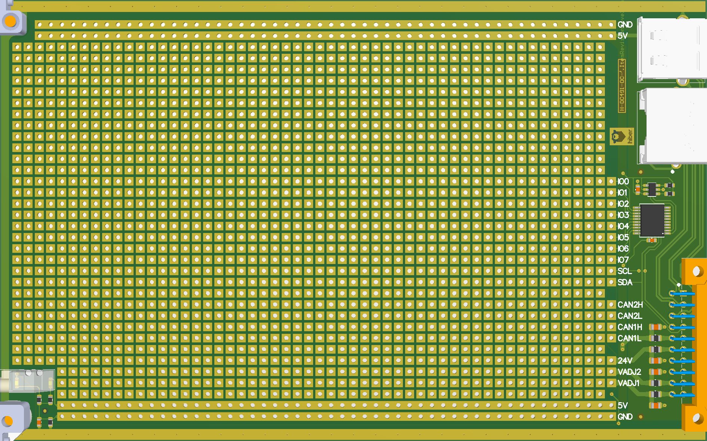

# Breakout Module

# Mounting Boards

The recommended way to integrate any existing board to the system is by using solderable thread inserts, for example like the ones from [Wurth](https://www.we-online.com/web/en/electronic_components/produkte_pb/produktinnovationen/smtspacer.php).

For larger boards a Right-Angle usb cable might be needed, like the following one:
Startech Male USB A to Male USB Micro B USB Cable, USB 2.0, 300mm, USB A, USB Micro B UUSBHAUB1LA

Identify the appropriate height (ideally make sure nothing extends over the frontpanel)

First attach the spacers to the board:

Then place on the desired location an solder down the spacers:

Plug in the USB/Ethernet cable.

nVent-SCHROFF, 3U Plug-in Unit

RS-stocknr.:
    258-2920
Fabrikantnummer:
    20817443
Fabrikant:
    nVent-SCHROFF