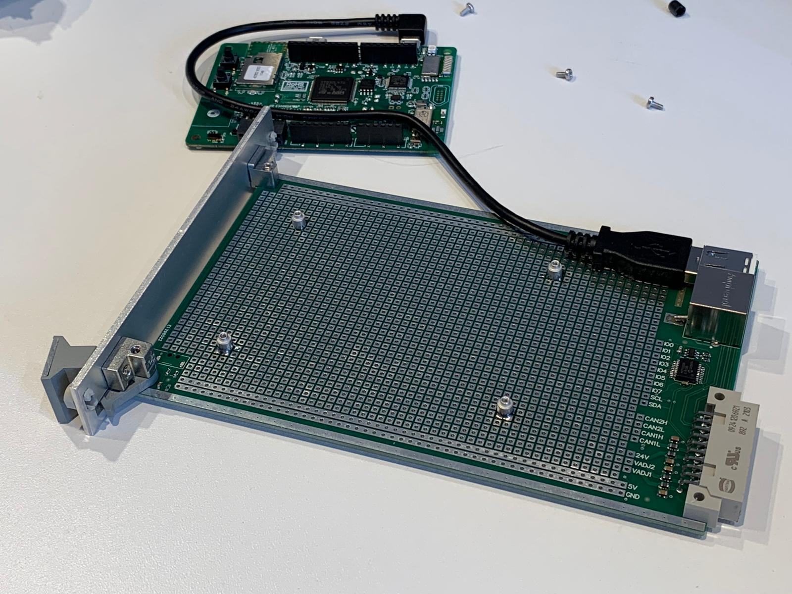

# Breakout Module

This module can be used integrate any existing board or other hardware to the system.

One way is by using solderable thread inserts, like the ones from [Wurth](https://www.we-online.com/web/en/electronic_components/produkte_pb/produktinnovationen/smtspacer.php).

For larger boards a (short) Right-Angle usb cable might be needed, for example: Startech Male USB A to Male USB Micro B USB Cable, USB 2.0, 300mm, USB A, USB Micro B UUSBHAUB1LA

To install a board:
- Identify the appropriate standoff height (ideally make sure nothing extends over the frontpanel).
- Attach the spacers to the board and place the board on the desired location.
- Solder down a corner of each spacer and remove the board.
- Strengthen solder joints.
- Re-install board (plug in cables)

nVent-SCHROFF, 3U Plug-in Unit

RS-stocknr.:
    258-2920
Fabrikantnummer:
    20817443
Fabrikant:
    nVent-SCHROFF

# Version History

## A.3
First Release

### Known Issues
- Missing Pin-1 Indicator on U10
- Increase solder mask sliver between ESD Cap/Res
- USB D+/D- Swapped
