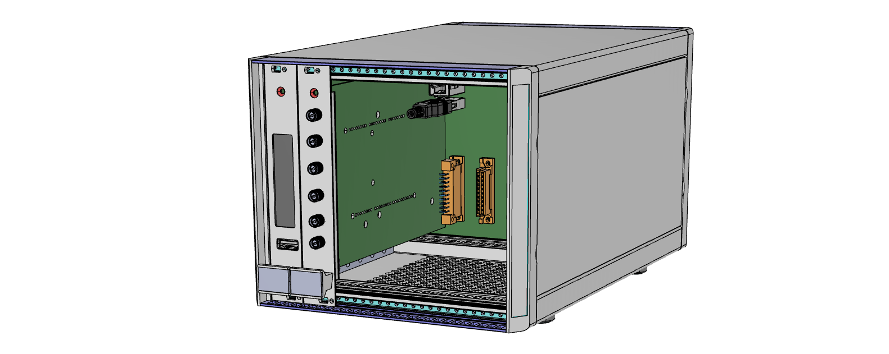
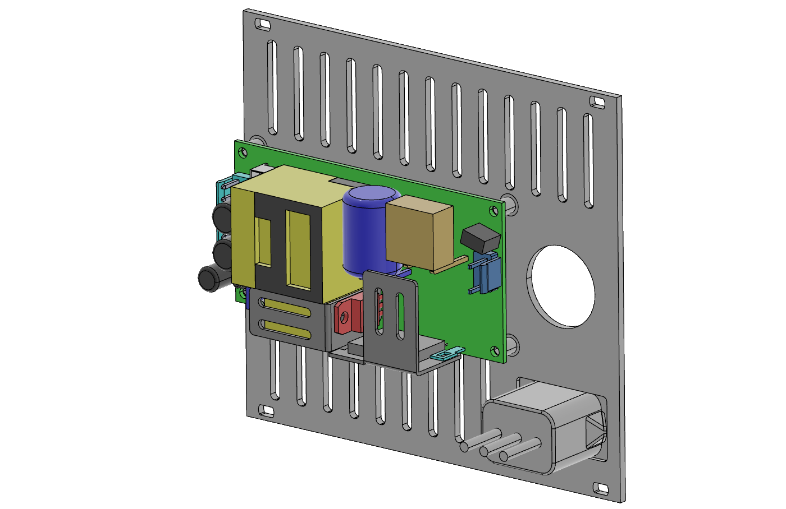
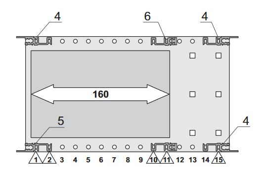
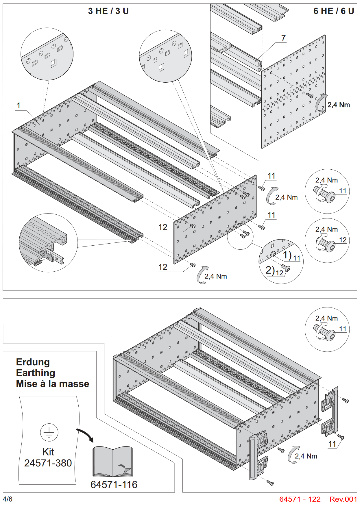
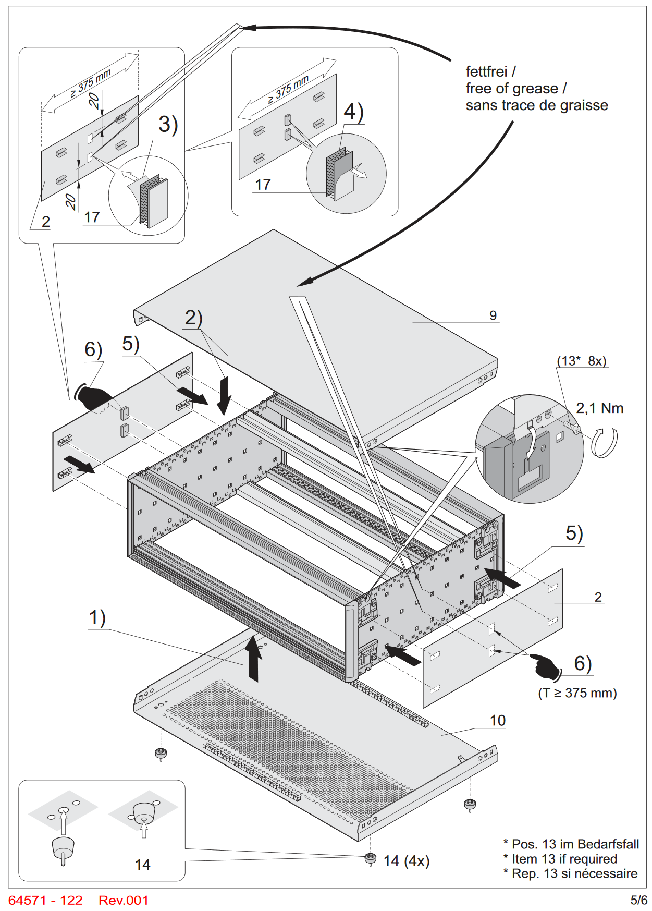

# Benchtop Enclosure
For smaller setups, or engineering workbenches a smaller form factor can be desirable. An 28HP housing can host a single backplane, as well as an internal AC power supply.

(TODO: Update render with guides and ESD clips)

The STEP model of the assembly is available [here](./Benchtop%20Assembly.stp)
(TODO: Add STEP Model)

# Bill of Materials

| Qty | Description                                                            | Manufacturer | Partnumber     |
|-----|------------------------------------------------------------------------|--------------|----------------|
| 1   | RatiopacPRO, Complete Case, Desktop, Unshielded, Front Trim, 3U, 28 HP | Schroff      | 24572-001      |
| 14  | Guide Rail Standard Type, Groove Width 2 mm, 160 mm, Red, SPQ 50       | Schroff      | 64560-001      |
| 7   | Guide Rail ESD Clip                                                    | Schroff      | 24560-255      |
| 1   | AC-DC Single output Open frame power supply; output 24Vdc at 5.9A      | Meanwell     | EPP-200-24     |
| 1   | AC Power Entry Modules 15A WIRE-LEADED                                 | TE           | 15SRBX8-R      |
| 1   | RJ-45 Ethernet Round Panel Mount Extension Cable - 30cm                | Adafruit     | 4215           |
| 1   | Connector Housing 3POS 3.96MM                                          | JST          | VHR-3N         |
| 1   | Connector Housing 6POS 3.96MM                                          | JST          | VHR-6N         |
| 6   | Pre-Crimped Jumper wire VH Series 16 AWG - 100mm*                      | JST          | ASVHSVH16K102  |
| 4   | A2 s/steel cross pan head screw, M3 x 6mm                              | RS PRO       | 528-738        |
| 14  | A2 s/steel cross pan head screw, M2.5 x 16mm                           | RS PRO       | 914-1484       |
| 1   | Rear Panel with mount for Power supply and Connectors (CNC Machined)   |              |                |
| 1   | Backplane PCB assembly (with protective cover)                         |              |                |

# Rear Panel
A customized rear panel is used instead of the one included with the kit. It can be ordered through Frontpanel Designer (US: [Frontpanel Express](https://www.frontpanelexpress.com/), EU: [Schaeffer](https://www.schaeffer-ag.de)).

Design files for Frontpanel Express are included in the [Rear Panel subfolder](./Rear%20Panel/). DXF and STEP files are also included.

# Assembly Instructions

## Rear Panel
- Install Ethernet Extension Cable and fasten ring nut.
- Insert power entry module (snaps into place)
- Mount Power supply on rear panel standoffs using M3-L6 Screws (Allign Line voltage on power entry side)
- Cut power entry wires to [xxx]mm, crimp terminals?
- Insert Pre-crimped wires into 6-way housing, cut to [xxx]mm length and strip around 5mm.

(TODO: Use pre-crimped wires or crimp on Power Entry Leads?)

## Assemble Case Frame
- Partially assembly case frame according to Schroff instructions:

- Note that it is easier to mount the backplane PCB before placing the rear rails:

- Place backplane to frame (Check alignment?) and fasten using M2.5 screws.
- Insert Rails with ESD clips on bottom side with 4HP spacing (2 free holes in between each rail)
- Insert Rails without ESD clips on top side
- Install Ground wiring (TODO)
- Plug Ethernet Cable in
- Connect 24V Leads to wire terminals (TODO)
- Power on, verify functionality
- Snap on outer panels according to Schroff instructions:

