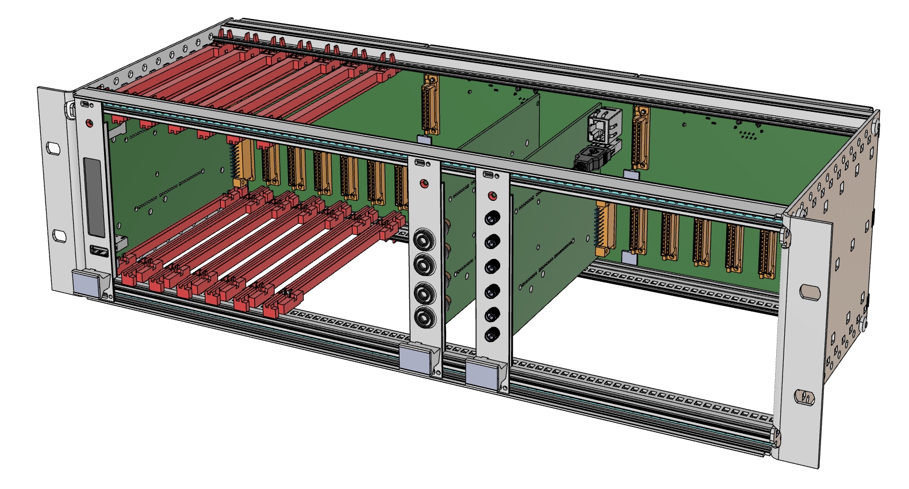
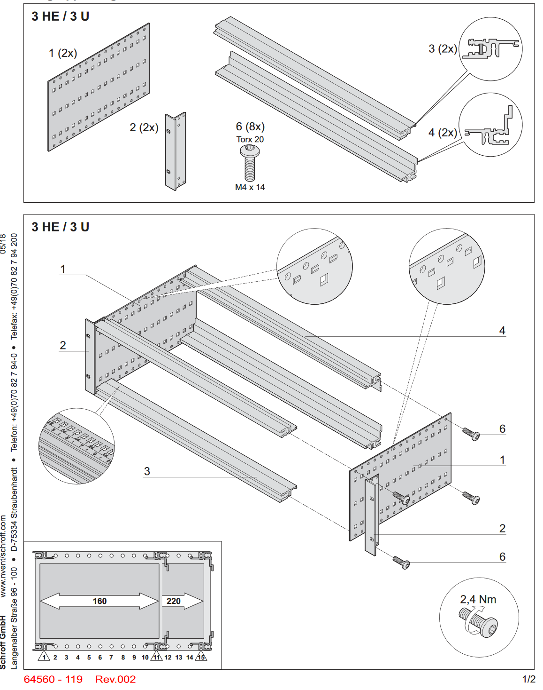

# 19" Rack
For larger scale setups a full 19" Rack can hold up to 21 modules. 

(TODO: Update render with guides and ESD clips)

The STEP model of the assembly is available [here](./Rack%20Assembly.stp)
(TODO: Add STEP Model)

# Bill of Materials

| Qty | Description                                                            | Manufacturer | Partnumber      |
|-----|------------------------------------------------------------------------|--------------|-----------------|
| 1   | EuropacPRO 19" Subrack Kit for DIN Connector, Retrofit Shielding, 3U   | Schroff      | 24563-192       |
| 42  | Guide Rail Standard Type, Groove Width 2 mm, 160 mm, Red, SPQ 50       | Schroff      | 64560-001       |
| 21  | Guide Rail ESD Clip                                                    | Schroff      | 24560-255       |
| 42  | A2 s/steel cross pan head screw, M2.5 x 16mm                           | RS PRO       | 914-1484        |
| 4   | CONN SSL BRIDGE 8POS 2MM                                               | AVX          | 009159008061916 |
| 2   | CONN SSL BRIDGE 10POS 2MM                                              | AVX          | 009159010061916 |
| 3   | Backplane PCB assembly (with protective cover)                         |              |                 |

# Assembly Instructions

- Assembly frame according to Schroff Instructions

- Mount Single backplane using M2.5 Screws
- Slide in Bridge Connectors
- Mount Slide in second backplane and fasten.
- Repeat for last backplane