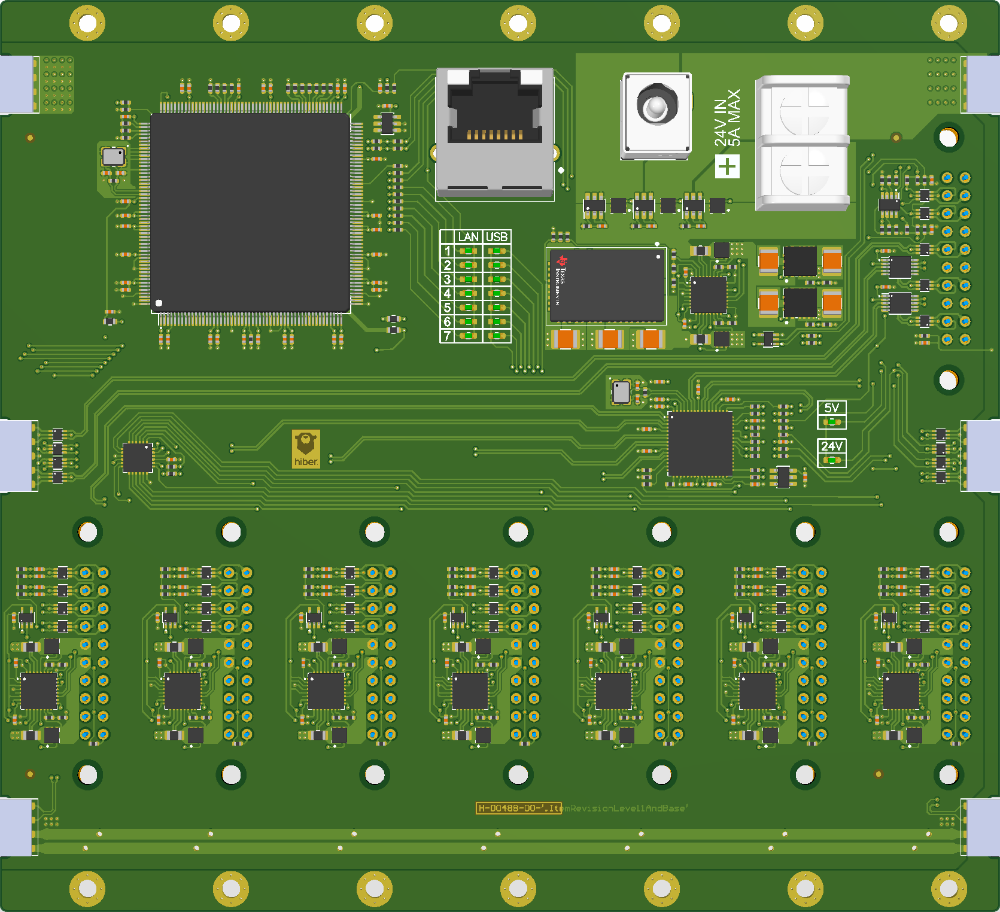

# Introduction
This repository contains design files and documentation for a modular test equipment rack. It was designed internally by Hiber to improve the efficiency around various test setups. It's targetted to the following use cases:
- Hardware bring-up and firmware development
- CI with Hardware in the Loop testing
- Integration testing of large / distributed systems

The key aspects on which it attempts to improve on are:
- Accessibility: Have every piece of hardware available on the network (and thus remotely)
- Portability: Make it easy to move components around or take them home.
- Repeatability: Make sure you always get the same results by having reproducable setups.
- Scaleability: The system should scale from develop desks (at home) ro large scale automated test racks.
- Low-Code: Where possible embedded firmware should be avoided so users not end up testing the test system. 

This work has been inspired by other great projects like these:
- [EasyPhi](http://www.easy-phi.ch/)
- [ARM Hardware Build Farm](https://www.collabora.com/about-us/blog/2013/04/26/collabora-custom-arm-hardware-build-farm/)
- [Raspberry Pi FM Stream Rack](https://medium.com/artica/fm-stream-tech-report-30b23c098bdb)

## License
The design has been made open source hoping that others can benifit from it. There is a lot of potential for adding additional modules (Like a configurable power supply, additional interfaces and various measurement equipment). All designs provided in this repository are released under [Apache 2.0 License](/LICENSE).

## Used Software
Boards have been made in Altium Designer, Mechanical assemblies have been done in CATIA. Neutral exports file formats are provided.

## Status
The Backplane and Breadboard module initial prototypes are finished. The Raspberri Pi Host module still have to be made for the system to start being practical (unless used for Ethernet Only applications). 

# System overview
The system is based on the very commonly used Eurocard Subrack formfactor. It is commonly used by modular test equipment like the PXI chassis and many others. The individual mechanical components are relatively low cost and widely available from multiple vendors. This design is baselined on the Schroff europacPro series and their Plug-In units, but others can be used if preferred.

A typical 19" rack is 3U high and 84HP wide (1 Horizontal Pitch = 5.08mm). In this housing the user can slide in Eurocard size PCBs or Modules with a 4HP wide pitch. The modules can either consist of instrumentation equipment or the Device Under Test itself. A generic backplane PCB provides connectivity and power to modules that are hot-swappable. By splitting the backplane into 3 identical 28HP segments the system can be scaled down to partial racks and benchtop housings.

It is highly recommended to scroll through Schroff's [catalog](https://schroff.nvent.com/sites/g/files/hdkjer281/files/acquiadam/2020-11/06_e_subracks.pdf) to get an idea about the possibilities. For example an 6U enclosure could also be used to support larger modules or double the capacity (or a combination of both).

## Enclosures

### Benchtop

For small setups or engineering workbenches a compact form factor is available. A 28HP housing can house a single backplane with an internal AC power supply. Bill of Material and Assembly instructions can be found in it's [directory](./Mechanical/Benchtop%207s)

### 19" Rack

For larger scale setups a full 19" Rack can hold up to 21 modules. Bill of Material and Assembly instructions can be found in it's [directory](./Mechanical/Rackmount%2021s)

### Stand-alone Adapter
To be Designed... Mostly used for troubleshooting. Similar to [this](http://easy-phi.unige.ch/index.php/products/racks-and-adapter/stand-alone-adapter). PoE? USB-C? Alternatively a 20-pin extension cable could potentially be used?

## Backplane

The core of the system is a 3U / 28HP backplane PCB that can be mounted in various mechanical configuations. The main functionality is:
- 24V Powered (5A Max)
- 7 Slots, of which 1 can be used as host (USB+I2C)
- Daisy-chainable up to three boards to fill a full rack
- 24V and 5V power distribution, protection and monitoring to modules (2A Max)
- 100Mbps Ethernet Switch (KSZ8999: 7 Slots + Uplink)
- USB 2.0 Hi-Speed 7-Port Hub Controller (USB2517)
- I2C Mux

More details (including pinouts) and design files can be found in it's [directory](./Boards/Backplane/).

## Modules

### Template
TBD

### CM4 Host
In Progress...

### Generic Carrier
A Generic plug-in card that contains a breakout connector for Ethernet and USB, as well as pads for the various other signals. It contains an EEPROM with UID for identification, and a MCP... port expander that can be used to drive distrete equipment.

It can be used to carry dev boards, boards to test or any other equipment.

Design files can be found in it's [directory](./Boards/Module%20-%20Breakout/).

## Ideas
- 6x Micromod carrier (Using USB2517) for testing wireless netwoks?